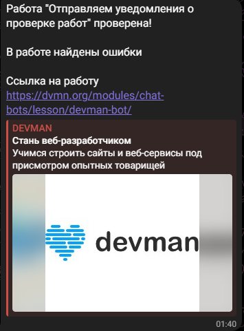

# Бот для проверки работ

Бот проверяет работы с образовательной платфоры [Devman](https://dvmn.org/)

## Как устаноить

Необходим python3, также нужно установить все зависимости командой:

```
pip install -r requirements.txt
```

После чего создать .env файл, куда поместить следующие переменные:

```
TG_BOT_TOKEN='<Token вашего бота>'
TG_CHAT_ID='<Ваш телеграмм Chat id>'
DEVMAN_TOKEN='<Ваш личный Token Devman>'
```

Token бота можно получить [здесь](https://web.telegram.org/k/#@BotFather)

Узнать свой ChatID  [здесь](https://web.telegram.org/k/#@userinfobot)

Запуск скрипта производтся командной

```
python main.py
```

## Пример работы скрипта


